<picture>
  <source media="(prefers-color-scheme: dark)" srcset="dark.svg">
  <source media="(prefers-color-scheme: light)" srcset="light.svg">
  
</picture>

 

## About

Data Science student focused on **Data Analytics** and **Machine Learning**.

## Tech Stack

## Connect

- GitHub: [github.com/KanakLilhare](https://github.com/KanakLilhare)
- LinkedIn: [linkedin.com/in/kanak-lilhare](https://www.linkedin.com/in/kanak-lilhare/)
## 👋 About Me

I’m a Data Science student interested in **Data Analytics, Machine Learning, NLP, and Data Visualization**.

I enjoy working with real-world data, building machine learning solutions, and creating dashboards that turn data into meaningful insights.

## 📊 GitHub Stats

  
  

## 🔥 GitHub Streak

  

## 🐍 Contribution Snake

  

## 🔗 Connect With Me

  
  

## 🚀 Featured Projects

🤖 MLOps Fraud Detection Platform
End-to-end credit card fraud detection platform using machine learning, MLflow, FastAPI, Docker, Streamlit, and monitoring tools.

🎵 Spotify Music Analytics
Data analytics project analyzing 114K+ music tracks using Python, PostgreSQL, and Power BI to explore genres, popularity, and audio features.

🌍 Delhi-NCR Air Quality Analysis
Data-driven analysis of PM2.5 pollution patterns across Delhi-NCR using Python, SQL, PostgreSQL, and Power BI.
## 🛠️ Skills

**Programming:** Python • SQL 

**Data Science:** Pandas • NumPy • Scikit-learn • Machine Learning • Data Analysis

**Visualization:** Power BI • Excel • Data Visualization

**Tools:** Git • GitHub • VS Code • FastAPI

---

⭐ Thanks for visiting my profile!
